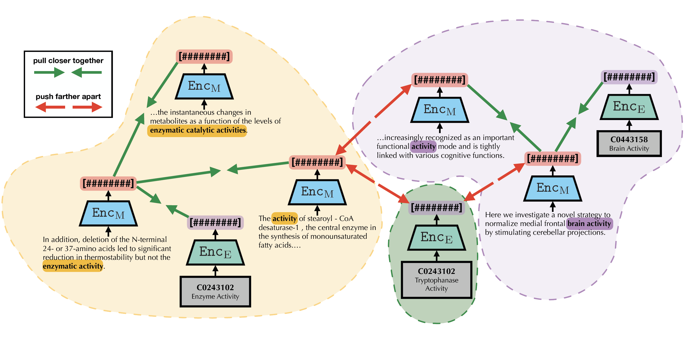

# ArboEL

**(NAACL 2022!)** Entity Linking via Explicit Mention-Mention Coreference Modeling: https://aclanthology.org/2022.naacl-main.343/  
Entity Linking & Discovery via Arborescence-based Supervised Clustering: https://arxiv.org/abs/2109.01242

---

## Overview

ArboEL is an entity linking and discovery system, which 
uses a directed MST (arborescence) supervised clustering objective to train
BERT-based dual-encoders coupled with multiple inference routines, including a 
transductive graph partitioning procedure
that makes predictions by jointly considering links between mentions as well as 
between mentions and entities. The repository additionally contains 
cross-encoder training and inference procedures that utilize the improved
representations provided by the arborescence-based dual-encoders.


## Citing

If you use ArboEL in your work, please cite the following paper:  
```bibtex
@inproceedings{agarwal-etal-2022-entity,
    title = "Entity Linking via Explicit Mention-Mention Coreference Modeling",
    author = "Agarwal, Dhruv  and
      Angell, Rico  and
      Monath, Nicholas  and
      McCallum, Andrew",
    booktitle = "Proceedings of the 2022 Conference of the North American Chapter of the Association for Computational Linguistics: Human Language Technologies",
    month = jul,
    year = "2022",
    address = "Seattle, United States",
    publisher = "Association for Computational Linguistics",
    url = "https://aclanthology.org/2022.naacl-main.343",
    pages = "4644--4658",
    abstract = "Learning representations of entity mentions is a core component of modern entity linking systems for both candidate generation and making linking predictions. In this paper, we present and empirically analyze a novel training approach for learning mention and entity representations that is based on building minimum spanning arborescences (i.e., directed spanning trees) over mentions and entities across documents to explicitly model mention coreference relationships. We demonstrate the efficacy of our approach by showing significant improvements in both candidate generation recall and linking accuracy on the Zero-Shot Entity Linking dataset and MedMentions, the largest publicly available biomedical dataset. In addition, we show that our improvements in candidate generation yield higher quality re-ranking models downstream, setting a new SOTA result in linking accuracy on MedMentions. Finally, we demonstrate that our improved mention representations are also effective for the discovery of new entities via cross-document coreference.",
}
```

## Setting up

- Install conda (we recommend 
[miniconda](https://docs.conda.io/en/latest/miniconda.html))
- Create an environment and install dependencies 
    ```bash
    conda create -n blink37 -y python=3.7 && conda activate blink37 && pip install -r requirements.txt && conda install cython pytorch==1.4.0 torchvision==0.5.0 cudatoolkit=10.1 -c pytorch
    ```
- Build cluster-linking special_partition function (from Cython)
    ```bash
    cd blink/biencoder/special_partition; python setup.py build_ext --inplace
    ```
- Our setup assumes GPU availability
  - The code for our paper was run using 2 NVIDIA Quadro RTX 8000

## Datasets

- [MedMentions](https://github.com/chanzuckerberg/MedMentions) (Full): The MedMentions corpus
consists of 4,392 papers (Titles and Abstracts) randomly selected from among papers 
released on PubMed in 2016, that were in the biomedical field, published in the 
English language, and had both a Title and an Abstract.
- [ZeShEL](https://github.com/lajanugen/zeshel): The Zero Shot Entity Linking dataset 
was constructed using multiple sub-domains in Wikia from FANDOM with automatically 
extracted labeled mentions using hyper-links.

### Download instructions
- **ZeShEL**:
  - Download the data files from the original ZeShEL repo (https://github.com/lajanugen/zeshel)
  - This should give you a directory called "zeshel" with 2 sub-directories - "documents" and "mentions"
  - Our pre-processing code (`arboEL/blink/preprocess/zeshel_*`) assumes you place this "zeshel" folder in `$PROJECT_ROOT/data`
- **MedMentions**:
  - Download the data files from https://drive.google.com/file/d/1qywgi4VkumB3dAtRx6aHWUX65XrCPGXL/view?usp=sharing
  - This should give you a directory called "medmentions" with 2 sub-directories - "documents" and "mentions"
  - Our pre-processing code (`arboEL/blink/preprocess/medmentions_*`) assumes you place this "medmentions" folder in `$PROJECT_ROOT/data`

## Pre-processing

- For MedMentions
  ```bash
  # Create the entity dictionary
  python blink/preprocess/medmentions_dictionary.py
  # Pre-process the query mentions
  python blink/preprocess/medmentions_preprocess.py
  ```
- For ZeShEL
  ```bash
  # Create the entity dictionary
  python blink/preprocess/zeshel_dictionary.py
  # Pre-process the query mentions
  python blink/preprocess/zeshel_preprocess.py
  ```

---

The following are example commands for **MedMentions**. For brevity, and to reduce repetition, commands for ZeShEL are omitted but can be constructed by simply swapping path values in these commands.
## Dual-encoder Training

### Arborescence
```bash
python blink/biencoder/train_biencoder_mst.py --bert_model=models/biobert-base-cased-v1.1 --data_path=data/medmentions/processed --output_path=models/trained/medmentions_mst/pos_neg_loss/no_type --pickle_src_path=models/trained/medmentions --num_train_epochs=5 --train_batch_size=128 --gradient_accumulation_steps=4 --eval_interval=10000 --pos_neg_loss --force_exact_search --embed_batch_size=3500 --data_parallel
```

### k-NN negatives
```bash
python blink/biencoder/train_biencoder_mult.py --bert_model=models/biobert-base-cased-v1.1 --data_path=data/medmentions/processed --output_path=models/trained/medmentions/pos_neg_loss/no_type --pickle_src_path=models/trained/medmentions --num_train_epochs=5 --train_batch_size=128 --gradient_accumulation_steps=4 --eval_interval=10000 --pos_neg_loss --force_exact_search --embed_batch_size=3500 --data_parallel
```

### In-batch negatives
```bash
python blink/biencoder/train_biencoder.py --bert_model=models/biobert-base-cased-v1.1 --num_train_epochs=5 --data_path=data/medmentions/processed --output_path=models/trained/medmentions_blink --data_parallel --train_batch_size=128 --eval_batch_size=128 --eval_interval=10000
```

## Dual-encoder Inference

### Linking
```bash
python blink/biencoder/eval_cluster_linking.py --bert_model=models/biobert-base-cased-v1.1 --data_path=data/medmentions/processed --output_path=models/trained/medmentions_mst/eval/pos_neg_loss/no_type/wo_type --pickle_src_path=models/trained/medmentions/eval --path_to_model=models/trained/medmentions_mst/pos_neg_loss/no_type/epoch_best_5th/pytorch_model.bin --recall_k=64 --embed_batch_size=3500 --force_exact_search --data_parallel
```

### Discovery
```bash
python blink/biencoder/eval_entity_discovery.py --bert_model=models/biobert-base-cased-v1.1 --data_path=data/medmentions/processed --output_path=models/trained/medmentions_mst/eval/pos_neg_loss/directed --pickle_src_path=models/trained/medmentions/eval --embed_data_path=models/trained/medmentions_mst/eval/pos_neg_loss --use_types --force_exact_search --graph_mode=directed --exact_threshold=127.87733985396665 --exact_knn=8 --data_parallel
```

## Cross-encoder Training
We specify cross-encoder commands for the Arborescence dual-encoder only for brevity. Commands for other variants can be constructed by simply swapping path values in these commands.

### (using Arborescence dual-encoder)
```bash
# Generate dual-encoder candidates
python blink/crossencoder/eval_cluster_linking.py --data_path=data/medmentions/processed --output_path=models/trained/medmentions/candidates/arbo --pickle_src_path=models/trained/medmentions --path_to_biencoder_model=models/trained/medmentions_mst/pos_neg_loss/no_type/epoch_best_5th/pytorch_model.bin --bert_model=models/biobert-base-cased-v1.1 --data_parallel --scoring_batch_size=64 --save_topk_result

# Run cross-encoder training
python blink/crossencoder/original/train_cross.py --data_path=data/medmentions/processed --pickle_src_path=models/trained/medmentions --output_path=models/trained/medmentions/crossencoder/arbo --bert_model=models/biobert-base-cased-v1.1 --learning_rate=2e-05 --num_train_epochs=5 --train_batch_size=2 --eval_batch_size=2 --biencoder_indices_path=models/trained/medmentions/candidates/arbo --add_linear --skip_initial_eval --eval_interval=-1 --data_parallel
```

## Cross-encoder Inference

### (using Arborescence dual-encoder)

#### Regular
```bash
python blink/crossencoder/original/train_cross.py --data_path=data/medmentions/processed --pickle_src_path=models/trained/medmentions --output_path=models/trained/medmentions/crossencoder/eval/arbo --eval_batch_size=2 --biencoder_indices_path=models/trained/medmentions/candidates/arbo --add_linear --only_evaluate --data_parallel --bert_model=models/biobert-base-cased-v1.1 --path_to_model=models/trained/medmentions/crossencoder/arbo/pytorch_model.bin
```

#### Oracle (Self Set)
```bash
python blink/crossencoder/original/train_cross.py --data_path=data/medmentions/processed --pickle_src_path=models/trained/medmentions --output_path=models/trained/medmentions/crossencoder/eval/arbo/oracle --eval_batch_size=2 --biencoder_indices_path=models/trained/medmentions/candidates/arbo --add_linear --only_evaluate --data_parallel --bert_model=models/biobert-base-cased-v1.1 --inject_eval_ground_truth=True --path_to_model=models/trained/medmentions/crossencoder/arbo/pytorch_model.bin
```

#### Oracle (Union Set)
```bash
python blink/crossencoder/original/train_cross.py --data_path=data/medmentions/processed --pickle_src_path=models/trained/medmentions --output_path=models/trained/medmentions/crossencoder/eval/arbo/oracle_union --eval_batch_size=2 --biencoder_indices_path=models/trained/medmentions/candidates --custom_cand_set=union --add_linear --only_evaluate --data_parallel --bert_model=models/biobert-base-cased-v1.1 --inject_eval_ground_truth=True --path_to_model=models/trained/medmentions/crossencoder/arbo/pytorch_model.bin
```

## Questions / Feedback

If you have any questions, comments, or feedback on our work, please reach out at
[dagarwal@cs.umass.edu](mailto:dagarwal@cs.umass.edu)! (or open a GitHub issue)

## Licence
ArboEL is MIT licensed. See the [LICENSE](LICENSE) file for details.

## Acknowledgements
We thank [BLINK](https://github.com/facebookresearch/BLINK) for the 
base infrastructure of this project.
